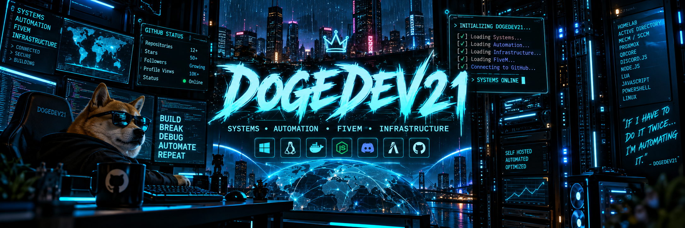

<div align="center">
  
</div>

<div align="center">

### Systems • Automation • FiveM • Infrastructure


<a href="https://github.com/dogedev21">

</a>

<br>


<br><br>


</div>

<!-- ═══════════════════════════════════════════════════════════════ -->
<!--                         TERMINAL                               -->
<!-- ═══════════════════════════════════════════════════════════════ -->

## `root@dogedev21:~# ./whoami`

```ansi
┌──────────────────────────────────────────────────────────────────────┐
│                                                                      │
│   ██████╗  ██████╗  ██████╗ ███████╗██████╗ ███████╗██╗   ██╗        │
│   ██╔══██╗██╔═══██╗██╔════╝ ██╔════╝██╔══██╗██╔════╝██║   ██║        │
│   ██║  ██║██║   ██║██║  ███╗█████╗  ██║  ██║█████╗  ██║   ██║        │
│   ██║  ██║██║   ██║██║   ██║██╔══╝  ██║  ██║██╔══╝  ╚██╗ ██╔╝        │
│   ██████╔╝╚██████╔╝╚██████╔╝███████╗██████╔╝███████╗ ╚████╔╝         │
│   ╚═════╝  ╚═════╝  ╚═════╝ ╚══════╝╚═════╝ ╚══════╝  ╚═══╝          │
│                                                                      │
├──────────────────────────────────────────────────────────────────────┤
│                                                                      │
│   USER       dogedev21                                               │
│   CLASS      Systems Builder                                         │
│   FOCUS      Infrastructure / Automation / FiveM                     │
│   SHELL      PowerShell + Bash                                       │
│   OS         Windows Server + Linux                                  │
│   STATE      ● ONLINE                                                │
│                                                                      │
└──────────────────────────────────────────────────────────────────────┘
```

<div align="center">

### `BUILD // BREAK // DEBUG // AUTOMATE`

</div>

I build things where **development meets infrastructure** — automation systems, Discord tooling, FiveM resources, server infrastructure, homelabs, and utilities designed to eliminate repetitive work.

```javascript
const dogedev21 = {
    role: "Systems Builder",

    interests: [
        "Systems Administration",
        "Infrastructure",
        "Automation",
        "Networking",
        "FiveM Development",
        "Homelabs"
    ],

    currentlyBuilding: [
        "Discord automation",
        "QBCore resources",
        "Administrative tooling",
        "Server infrastructure"
    ],

    rule: "If I have to do it twice, automate it."
};
```

<br>

<!-- ═══════════════════════════════════════════════════════════════ -->
<!--                         STACK                                  -->
<!-- ═══════════════════════════════════════════════════════════════ -->

<div align="center">

# `// TECHNOLOGY LOADOUT`

### `{ DEVELOPMENT }`


<br>

### `{ INFRASTRUCTURE }`


<br>

### `{ TOOLCHAIN }`


<br><br>


<br>


</div>

<br>

<!-- ═══════════════════════════════════════════════════════════════ -->
<!--                         PROJECTS                               -->
<!-- ═══════════════════════════════════════════════════════════════ -->

# `// ACTIVE SYSTEMS`

```text
╭──────────────────────────────────────────────────────────────────╮
│                    DOGEDEV21 // SYSTEM INDEX                     │
├──────┬───────────────────────────────┬─────────────┬──────────────┤
│ ID   │ SYSTEM                        │ ACCESS      │ STATE        │
├──────┼───────────────────────────────┼─────────────┼──────────────┤
│ 001  │ doge_jobmail                  │ PUBLIC      │ ● ONLINE     │
│ 002  │ SAMS Nexus                    │ PRIVATE     │ ● ACTIVE     │
│ 003  │ Ticket Category Manager       │ PRIVATE     │ ● ACTIVE     │
│ 004  │ FiveM Infrastructure          │ PRIVATE     │ ● BUILDING   │
╰──────┴───────────────────────────────┴─────────────┴──────────────╯
```

---

## `SYS.001 // DOGE_JOBMAIL`

<div align="left">


</div>

### QBCore × LB Phone Employment Automation

Automatically delivers immersive in-game emails when employment events occur through `qb-management`.

```text
                            ┌──────────────┐
                     ┌─────►│    HIRED     │
                     │      └──────┬───────┘
                     │             │
                     │      ┌──────▼───────┐
                     ├─────►│   PROMOTED   │
                     │      └──────┬───────┘
                     │             │
┌──────────────┐     │      ┌──────▼───────┐     ┌──────────────┐
│ QB-MANAGEMENT├─────┼─────►│ DOGE_JOBMAIL ├────►│   LB PHONE   │
└──────────────┘     │      └──────▲───────┘     └──────┬───────┘
                     │             │                    │
                     │      ┌──────┴───────┐            ▼
                     ├─────►│   DEMOTED    │        [ PLAYER ]
                     │      └──────────────┘
                     │
                     │      ┌──────────────┐
                     └─────►│  TERMINATED  │
                            └──────────────┘
```

`Lua` · `QBCore` · `qb-management` · `LB Phone`

<a href="https://github.com/dogedev21/doge_jobmail">

</a>

---

## `SYS.002 // SAMS NEXUS`


### Modular Discord Operations Platform

```text
                       ┌─────────────────────┐
                       │      SAMS NEXUS     │
                       │     CORE ROUTER     │
                       └──────────┬──────────┘
                                  │
          ┌───────────────┬───────┼───────┬───────────────┐
          ▼               ▼       ▼       ▼               ▼
     ┌─────────┐     ┌─────────┐ ┌─────┐ ┌─────────┐ ┌─────────┐
     │   FTO   │     │ PROMO   │ │ADMIN│ │ EVENTS  │ │ANALYTICS│
     └────┬────┘     └────┬────┘ └──┬──┘ └────┬────┘ └────┬────┘
          │               │          │         │           │
          ▼               ▼          ▼         ▼           ▼
      REQUESTS         ROLES       CONTROL    RSVP       METRICS
      THREADS          RANKS       LOGGING    ALERTS     PRESENCE
      TIMEOUTS         ALERTS      ACTIONS    CLEANUP    STORAGE
```

Built around modular systems rather than one giant bot file.

`Node.js` · `Discord.js` · `Automation` · `Event Systems`

---

## `SYS.003 // TICKET CATEGORY MANAGER`


### Discord Ticket Workflow Engine

```bash
doge@discord:~$ ticketctl --help

COMMAND                 ACTION
────────────────────────────────────────────────────────
/ticket claim           Assign + relocate ticket
/ticket unclaim         Restore original ticket state
/ticket transfer        Transfer ticket ownership
/ticket status          Inspect current assignment

/ticketsetup             Configure workflow infrastructure
```

Handles category movement, staff assignment, permission synchronization, ticket transfers, and restoration of original channel permissions.

`Node.js` · `Discord.js` · `Permission Management` · `Automation`

<br>

<!-- ═══════════════════════════════════════════════════════════════ -->
<!--                        INFRASTRUCTURE                          -->
<!-- ═══════════════════════════════════════════════════════════════ -->

# `// HOMELAB NETWORK`

```text
                         ┌──────────────────────┐
                         │       INTERNET       │
                         └──────────┬───────────┘
                                    │
                              ┌─────▼─────┐
                              │  ROUTING  │
                              └─────┬─────┘
                                    │
                  ┌─────────────────┴─────────────────┐
                  │                                   │
          ┌───────▼────────┐                  ┌───────▼────────┐
          │ WINDOWS DOMAIN │                  │    PROXMOX     │
          │                │                  │                │
          │  AD DS         │                  │ Virtualization │
          │  DNS           │                  │ VM Hosting     │
          │  DHCP          │                  │ Linux Systems  │
          │  GPO           │                  └────────────────┘
          └───────┬────────┘
                  │
         ┌────────┴─────────┐
         │                  │
 ┌───────▼────────┐ ┌───────▼────────┐
 │      MECM      │ │    CLIENTS     │
 │                │ │                │
 │ PXE / OSD      │ │ Windows       │
 │ Applications   │ │ Managed PCs   │
 │ Management     │ │ Lab Systems   │
 └────────────────┘ └────────────────┘
```

<div align="center">

`ACTIVE DIRECTORY` • `MECM` • `PROXMOX` • `DNS` • `DHCP` • `PXE` • `GPO` • `POWERSHELL`

</div>

<br>

<!-- ═══════════════════════════════════════════════════════════════ -->
<!--                        TELEMETRY                               -->
<!-- ═══════════════════════════════════════════════════════════════ -->

<div align="center">

# `// LIVE TELEMETRY`


<br><br>


</div>

<br>

<!-- ═══════════════════════════════════════════════════════════════ -->
<!--                     CONTRIBUTION GRAPH                         -->
<!-- ═══════════════════════════════════════════════════════════════ -->

<div align="center">

# `// NETWORK ACTIVITY`


</div>

<br>

<!-- ═══════════════════════════════════════════════════════════════ -->
<!--                     CONTRIBUTION SNAKE                         -->
<!-- ═══════════════════════════════════════════════════════════════ -->

<div align="center">

# `// CONTRIBUTION MATRIX`

<picture>
  <source media="(prefers-color-scheme: dark)" srcset="https://raw.githubusercontent.com/dogedev21/dogedev21/output/github-contribution-grid-snake-dark.svg">
  <source media="(prefers-color-scheme: light)" srcset="https://raw.githubusercontent.com/dogedev21/dogedev21/output/github-contribution-grid-snake.svg">
  
</picture>

</div>

<br>

<!-- ═══════════════════════════════════════════════════════════════ -->
<!--                       OBJECTIVES                               -->
<!-- ═══════════════════════════════════════════════════════════════ -->

# `// ACTIVE OBJECTIVES`

```diff
+ [ONLINE]  Build better Discord automation
+ [ONLINE]  Develop FiveM / QBCore resources
+ [ONLINE]  Expand homelab infrastructure
+ [ONLINE]  Automate repetitive workflows

! [LEARN]   System architecture
! [LEARN]   Enterprise infrastructure
! [LEARN]   Networking
! [LEARN]   Backend development

- [DENIED]  Doing the same thing manually twice
```

<br>

<!-- ═══════════════════════════════════════════════════════════════ -->
<!--                         STATUS                                 -->
<!-- ═══════════════════════════════════════════════════════════════ -->

<details>
<summary><b>⚡ &nbsp; OPEN SYSTEM DIAGNOSTICS</b></summary>

<br>

```text
╭────────────────── DOGEDEV21 SYSTEM MONITOR ──────────────────╮
│                                                              │
│  NODE             dogedev21                                  │
│  STATE            ● ONLINE                                   │
│  SECURITY         ███████████████████░    95%                │
│  AUTOMATION       ████████████████████   100%                │
│  HOMELAB          ████████████████░░░░    82%                │
│  COFFEE           ████████████████████   100%                │
│  SLEEP            █████░░░░░░░░░░░░░░░    24%                │
│                                                              │
│  UPTIME           probably too long                          │
│  LAST INCIDENT    classified                                 │
│  NEXT INCIDENT    inevitable                                 │
│                                                              │
├──────────────────────────────────────────────────────────────┤
│                                                              │
│  > ping infrastructure                                      │
│    Reply: 1ms                                               │
│                                                              │
│  > check automation                                         │
│    All systems operational.                                 │
│                                                              │
│  > check homelab                                            │
│    ...                                                      │
│    Define "operational."                                    │
│                                                              │
╰──────────────────────────────────────────────────────────────╯
```

</details>

<br>

<div align="center">


<br>

```text
╔══════════════════════════════════════════════════════╗
║                                                      ║
║               END OF TRANSMISSION                    ║
║                                                      ║
║                github.com/dogedev21                   ║
║                                                      ║
╚══════════════════════════════════════════════════════╝
```

### `doge@github:~$ █`

<sub>There is a non-zero chance the homelab is currently on fire.</sub>

<br>


</div>
